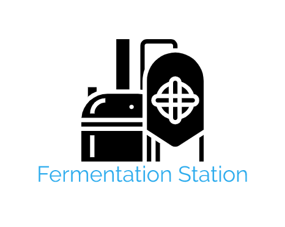

# Fermentation Station

---

Welcome to **Fermentation Station**. A place where people who love the taste of **Craft Beer** and **Beer Infused Food Produce** can come and find the products they enjoy. 

## UX
---

### User Stories 

*Generic User*

* As a user, I want to be able to **learn** about a variety of Craft Beers and Beer Infused Food Produce. 

* As a user, I want to be able to **keep up to date** about my favourite Craft Beers and Beer Infused Food Produce from the list of products. 

* As a user, I want to be able to **request** my favourite Craft Beers and Beer Infused Food Produce be added to the site. 

* As a user, I want to be able to **Add** my favourite Craft Beers and Beer Infused Food Produce to a shopping cart and check out. 

*Developers Goals* 

* As a developer, I want to be able to create a usable app. 

* As a developer, I want to be able to increase the passion for Craft Beers and Beer Infused Food Produce.

### Design 

1. **Logo** 
The logo was created using [Free Logo Maker](https://logomakr.com). It was designed to to show the love for beer and symbolise the process of making beer. 

2. **Colour Scheme**

The colours for the website were chosen using [Coolors](https://coolors.co/). They were chosen with the aim to represent the Fermentation Brand and the love that goes into it. The chosen colours are:


3. **Fonts**

The website has the main font of Roboto Slab, which was chosen due to it **readability to all users**. Furthermore, it modern which will fit with the aim of the website. It was chosen using [Google Fonts](https://fonts.googleapis.com/css2?family=Roboto+Slab&display=swap) and has the default of Sans Serif. 

4. **Wireframes**

The wireframes for this website where created using [Balsamiq](https://balsamiq.com/wireframes/?gclid=CjwKCAjwltH3BRB6EiwAhj0IUBrAHe-2BiRjQmQGSO-FZIjoEjkckL_kVyJXd5ShGVwKqDaDMqKjvBoCQksQAvD_BwE)


### Database Structure

Key      | Value
---------|-----------
_id      | ObjectId
username | String
password | String

Key           | Value
--------------|-----------
_id           | ObjectId
prouct        | String
total_price   | String

Key           | Value
--------------|-----------
_id           | ObjectId
beer          | String
price         | String
taste         | String
colour        | String
description   | String

Key           | Value
--------------|-----------
_id           | ObjectId
food          | String
price         | String
description   | String

## Features
---

### Existing Features

The features that were added to the project were designed to have a high level of usability.

### Features Left to Implement

## Technologies Used
---

### **Languages:**

* HTML
* CSS
* JavaScript
* JSON
* Python 

## **Frameworks and Libraries**

* [Bootstrap](https://getbootstrap.com/)
* [Font Awesome](https://fontawesome.com/)
* [Google Fonts](https://fonts.google.com/specimen/Lato?sidebar.open&selection.family=Lato)
* Django

### **Tools Used**

* [Coolors](https://coolors.co/3c1642-086375-1dd3b0-fffdfd-ffffff) 
* [Balsamiq](https://balsamiq.com/wireframes/?gclid=CjwKCAjwltH3BRB6EiwAhj0IUBrAHe-2BiRjQmQGSO-FZIjoEjkckL_kVyJXd5ShGVwKqDaDMqKjvBoCQksQAvD_BwE)
* [Free Logo Maker](https://logomakr.com)
* [Gitpod Online IDE](https://www.gitpod.io/)
* [Github](https://github.com/)
* [Favicon Creator](https://www.favicon.cc/?action=import_request)

## Testing
---

* Implementation - The app was tested throughout the development to esure there were no errors.

* Test - I ran the app from the cmd line and checked each new feature as it was added.

* Result - The app works as it is intended 

* Verdict - The tests passed once the bugs were fixed

### All Sections

## Deployment 
---
Below is an example of how to deploy this site locally based on using VsCode IDE, deploying to Heroku using Amazon S3 for hosting of static and media files. This will allow the site to deploy automatically with commits to the master branch. The code can also be run locally.

### Deployment Requirements

* Gitpod IDE
* Python Documenttation
* PIP packge installer
* Stripe payment infastructure

### Deloying Locally 

1. Clone a copy of the repository by clicking code at the top of the page and selecting 'Download Zip' when this has downloaded, extract the files to your folder of choice. Alternatively if you have git installed on your client you can run the following command from the terminal.


   ```bash
   git clone https://github.com/D0nni387/fermentation-station-app.git
   ```

2. Open us your local IDE (For this example we will be using VScode as linked in the requirements) and open the working folder.

3. Ideally you will want to work within a virtual environment to allow all packages to be kept within the project, this can be installed using the following command (please note some IDE's require pip3 instead of pip, please check with the documentation for your chosen IDE)

```bash
pip install pipenv
```

4. In your root dir, create a new folder called .venv (ensure you have the .)

5. To activate the virtual environment navigate to the below dir and run activate.bat

```bash
[folderinstalled]\scripts\activate\activate.bat
```

If you're using Linux or Mac use the below command 

```bash
source .venv/bin/activate
```

6. Next we need to install all modules required by the project to run, use the follow

```bash
pipenv install -r requirements.txt
```

7. Create a new folder within the root dir called env.py. Within this file add the following lines to set up the environmental variables.

```bash
import os

os.environ["SECRET_KEY"] = "[Your Secret Key]"
os.environ["DEV"] = "1"
os.environ["HOSTNAME"] = "0.0.0.0"
os.environ["STRIPE_PUBLIC_KEY"] = "[Your Stripe Key]"
os.environ["STRIPE_SECRET_KEY"] = "[Your Stripe Secret Key]"
os.environ["DATABASE_URL"] = "[Your DB URL]"
```

### Database setup

1. To set up your database you will first need to run the following command

```bash
python manage.py migrate
```

2. To create a super user to allow you to access the admin panel run the following command in your terminal and complete the required information as prompted

```bash
python manage.py createsuperuser
```

3. From there you should now be able to run the server using the following command

```bash
python manage.py runserver
```

4. If everything has been correctly configure you should not get a message giving you a link to your locally hosted site usually at http://127.0.0.1:8000

5. Next close the server in your terminal using ctrl+c (cmd+c on mac) and run the following commands to populate the database

```bash
python manage.py loaddata store/fixtures/categories.json
python manage.py loaddata store/fixtures/products.json
python manage.py loaddata clients/fixtures/clients.json
```

### Deploying to Heroku

To run this application in an online environment you will need to deploy the code to *Heroku*.
Before moving on to this section please ensure you have followed the instructions for local deployment and this has been successful

1. Either create an account at [Heroku](https://www.heroku.com/) or log in to your account
2. Set up a new app under a unique name
3. In the resources section, in the addons field type the below command and select the free cost option

```bash
heroku Postgres
```

1. in the settings tab select Reveal Config Vars and copy the pre populated DATABASE_URL into your settings.py file in your project
2. in the Config Vars in Heroku you will need to populate with the following keys

|          Key          |     Value    |
|:---------------------:|:------------:|
| AWS_ACCESS_KEY_ID     | [your value] |
| AWS_SECRET_ACCESS_KEY | [your value] |
| SECRET_KEY            | [your value] |
| STRIPE_PUBLIC_KEY     | [your value] |
| STRIPE_SECRET_KEY     | [your value] |
| USE_AWS               | TRUE         |
| DATABASE_URL          | [Your Value] |

2. Now this has been configured you will now migrate the local database to the cloud database using the migrate command as below

```bash
python manage.py migrate
```

1. Next you will need to create a super user and populate the database as described in the database set up section
2. When the migrations and data has been loaded, in your *Heroku* dashboard select the Deploy tab
3. From here select the Github option and connect the repository from GitHub and select the branch (Master) to deploy from.
4. It is advised to select automatic deployment to ensure for each push to Github the hosted version is up to date.
5. When this has deployed select open app from the top bar of the *Heroku* App.


## Credits

* I would like to thank [Simen Dehlin](https://github.com/Eventyret) for his continued support, help and words of encouragement throughout this project. 


***This project is fictitous and was created for educational purposes as part of the Code Institute Milestone Project 4***